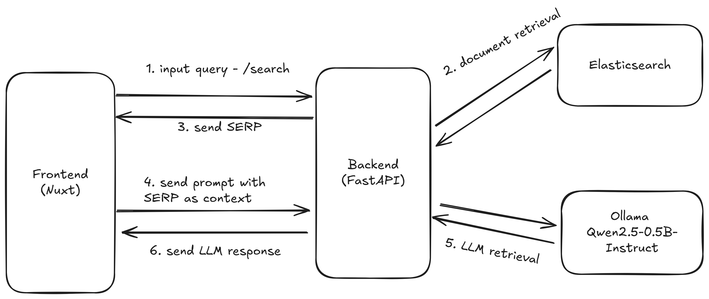

# Organa-App Backend

## Sistem & Arsitektur

Organa-App Backend adalah layanan REST API berbasis **FastAPI** yang menangani proses pencarian, pengambilan, dan analisis artikel dari **PubMed Central (PMC)** menggunakan Elasticsearch dan LLM (Large Language Models) untuk kebutuhan pemrosesan lanjutan.

Sistem dibangun dengan pendekatan berbasis komponen modular menggunakan Nuxt.js di frontend, FastAPI di backend, serta Elasticsearch dan LLM (Ollama) sebagai komponen pencarian dan inferensi.


### Arsitektur utama:

- **Framework Frontend**: Nuxt
- **Framework Backend**: FastAPI
- **Database/Engine**: Elasticsearch
- **Integrasi AI**: Ollama Qwen2.5-0.5B-Instruct
- **Komunikasi**: REST API berbasis JSON
- **Deployment Ready**: Docker + Docker Compose

### Alur Sistem:
1. Pengguna memasukkan query melalui /search di frontend
2. Backend mengambil dokumen relevan dari Elasticsearch
3. Backend mengirim hasil pencarian (SERP) ke frontend
4. Frontend mengirim prompt dengan konteks SERP ke backend
5. Backend memanggil LLM dari Ollama untuk menjawab berdasarkan konteks
6. Hasil jawaban dikirim kembali ke frontend




---

## Cara Instalasi & Menjalankan Sistem

1. Clone repository

```bash
git clone https://github.com/Organa-App/backend.git
cd backend
```
2. Konfigurasi Environment

Buat file `.env` dengan isi sebagai berikut
```
# Elasticsearch Configuration
ELASTICSEARCH_HOST=localhost
ELASTICSEARCH_PORT=9200
ELASTICSEARCH_INDEX=pmc_articles


# Ollama
OLLAMA_API_URL=http://34.132.137.143:11434/api
```

3. Jalankan service pendukung (Elasticsearch) via Docker Compose
```bash
docker compose up -d
```

4. Install dependencies Python

Disarankan menggunakan virtual environment:

```
python -m venv venv
source venv/bin/activate  # Linux/macOS
venv\Scripts\activate     # Windows

pip install -r requirements.txt
```

5. Load data ke Elasticsearch (jika belum diindex)
```
python load_data_bulk_v2.py
```

6. Jalankan API

```
fastapi run dev --port 8000
```

API akan tersedia di http://localhost:8000


## Dokumentasi Endpoint

### 🔁 Health Check
**GET /** <br>
Cek status layanan dan koneksi Elasticsearch.


### 🔍 Search Artikel
**GET /articles/search**  <br>
Pencarian artikel PMC berdasarkan query dan filter tambahan.

Query Parameters:

- query (wajib)

- page, size, article_type, journal, date_from, date_to

### 📄 Get Artikel Spesifik
**GET /articles/{article_id}** <br>
Ambil satu artikel berdasarkan ID (DOI / PMC ID / PMID).


**🤖 LLM Endpoint**

**GET /llm/models** <br>
Daftar model LLM yang tersedia

**POST /llm/generate** <br>
Generate teks dari prompt dan dokumen

**POST /llm/summarize** <br>
Ringkasan artikel-artikel terbaik


## Dataset
Sistem ini menggunakan dataset dari PubMed Central Open Access (Non-Commercial):
[https://ftp.ncbi.nlm.nih.gov/pub/pmc/oa_bulk/oa_noncomm/](https://ftp.ncbi.nlm.nih.gov/pub/pmc/oa_bulk/oa_noncomm/)

🔖 Atribut Data yang Digunakan

- doi – Pengenal unik artikel
- title – Judul artikel
- abstract – Ringkasan isi
- full_text – Isi lengkap artikel
- authors – Nama penulis
- journal – Jurnal penerbit
- keyword – Kata kunci terkait


🎯 Alasan Penggunaan

- Format terstruktur & lengkap (cocok untuk mesin pencari)
- Akses terbuka & legal untuk riset non-komersial
- Kualitas tinggi dan relevan untuk bidang biomedis


## Contoh Penggunaan API

**1. Cek koneksi**

Buka di browser: `http://localhost:8000`


**2. Cari artikel**
```http
GET /articles/search?query=cancer&page=1&size=10
```

**3. Ambil artikel tertentu**
```http
GET /articles/PMC1234567
```

**4. Ringkasan artikel**
```http
POST /llm/summarize
Content-Type: application/json
Body: [ { "title": "Title 1", "abstract": "Abstract 1" }, ... ]
```